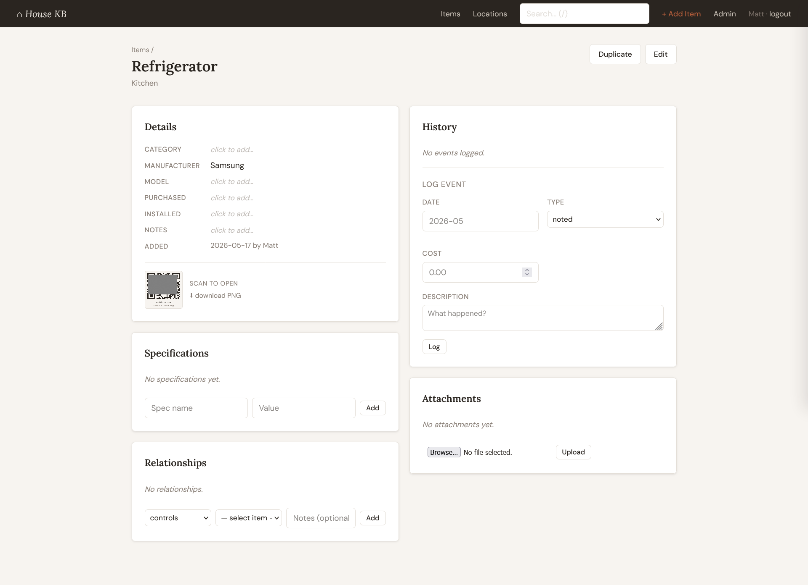

# House KB

A self-hosted property knowledge base for tracking everything in your home — appliances, fixtures, systems, tools, and maintenance history.

Built with Flask + SQLite. Runs on a Raspberry Pi, a home server, or any Linux box.



## Features

- **Location hierarchy** — organize by property → building → room/zone, with accordion tree navigation
- **Item inventory** — track manufacturer, model, purchase/install dates, notes
- **Flexible specs** — EAV attribute system for arbitrary key/value data per item (serial numbers, filter sizes, engine hours, etc.)
- **Maintenance history** — log events (purchased, installed, repaired, inspected) with dates and costs
- **Attachments** — upload receipts and photos (jpg, png, heic, pdf); HEIC auto-converted to JPEG
- **Relationships** — link items (controls, feeds, connected_to, part_of, adjacent_to)
- **JSON API** — bearer token auth for agent/automation access
- **Multi-user** — session auth with admin panel for user and API key management

## Requirements

- Python 3.10+
- `libheif1` (for HEIC image support): `sudo apt install libheif1`

## Quick Start

```bash
git clone https://github.com/YOURUSER/house-kb.git
cd house-kb
bash setup.sh
```

The setup script will:
1. Create a Python virtualenv and install dependencies
2. Generate a `.env` file with a random secret key
3. Prompt you to set `HOUSE_DB` and `HOUSE_UPLOADS` paths in `.env`
4. Initialize the database and create your admin user

Then start the app:

```bash
venv/bin/python3 app.py
```

Visit `http://localhost:5055`

## Configuration

All config is via `.env` (copied from `.env.template`):

| Variable | Description | Default |
|---|---|---|
| `HOUSE_SECRET` | Flask session secret (auto-generated) | — |
| `HOUSE_DB` | Path to SQLite database file | `./data/house.db` |
| `HOUSE_UPLOADS` | Path to file upload directory | `./uploads` |

## Systemd Service

Edit `house-kb.service` — set `User` and `WorkingDirectory` to match your setup:

```bash
sudo cp house-kb.service /etc/systemd/system/
sudo systemctl daemon-reload
sudo systemctl enable --now house-kb
```

## Reverse Proxy (Caddy)

```
http://house.yourdomain.local {
    reverse_proxy localhost:5055
}
```

## API

Authenticate with an `X-API-Key` header. Generate keys via the admin panel.

| Endpoint | Method | Description |
|---|---|---|
| `/api/items` | GET | List items (filter by `category`, `location_id`, `q`) |
| `/api/items/<id>` | GET | Get item with attributes and events |
| `/api/items` | POST | Create item |
| `/api/items/<id>` | PATCH | Update item fields and/or attributes |
| `/api/locations` | GET | List all locations |
| `/api/search` | GET | Full-text search across items and attributes |

## License

MIT
